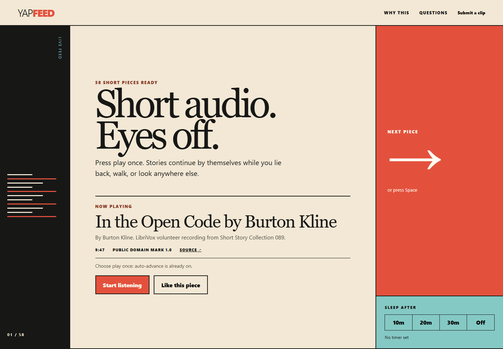

# Yapfeed

Yapfeed is a no-account feed of short, credited public-domain audio for people who want entertainment while resting their eyes. Press play once and the pieces continue automatically; skip with one large button or the Space key, and set a 10, 20 or 30 minute sleep timer.

Live app: [https://s72-yapfeed.pages.dev](https://s72-yapfeed.pages.dev)



## Who it is for

Yapfeed is for someone who wants a short listen without choosing a full podcast episode or continuing to watch a screen.

The idea was contributed by the owner's partner. In her words:

> “For people who want entertainment but want to rest their eyes.”

Source: [the Yapfeed brief in `RUN-PROMPT.md`](https://github.com/FishyDanny/ship72/blob/main/RUN-PROMPT.md#the-consumer-bet)

That quote is problem evidence, not a testimonial. Yapfeed has no claimed users or traction at launch.

## What it does

- Starts a continuous queue with one press and advances when each piece ends.
- Exposes play, pause, next and previous actions through the Media Session API where the browser supports them.
- Provides a large next button, Space-to-skip and a sleep timer without hiding auto-advance behind a setting.
- Keeps likes, skips and the current queue position in this browser; listening needs no account.
- Accepts links to clips of 60 seconds or less into a private pending queue. Nothing submitted is published automatically.

Yapfeed deliberately has no profiles, follows, comments, direct messages or open publishing feed.

## Audio, licence and attribution

The initial feed contains 58 eligible recordings selected from five LibriVox Short Story Collections in the Internet Archive: collections 81, 89, 92, 94 and 114. Each source collection is marked with the [Public Domain Mark 1.0](https://creativecommons.org/publicdomain/mark/1.0/).

Yapfeed does not copy or host the audio. It streams each MP3 from its Internet Archive source URL and stores only catalogue metadata. Every player entry shows the title, source collection, public-domain status and an attribution naming the author and LibriVox volunteer recording collection. Public-domain material still receives credit.

Submissions must include an HTTPS audio link and enter a human review queue. The submitter is responsible for having the right to share it; approval is not automatic.

## Privacy

Listening does not require an account. Likes, skip history and queue position remain in local storage in the current browser. Audio requests go directly to Internet Archive.

To measure whether the feed works, Yapfeed sends its server an anonymous SHA-256 session hash with the clip identifier and whether the piece was completed or skipped. It does not create a listener profile. A submission sends the supplied email address, audio URL, duration and note to a private pending-review queue; email addresses never appear in the feed.

## Current limitations

- Media Session and lock-screen handlers are implemented, but background playback has not yet been verified on a physical phone with the screen locked. Browser and operating-system behaviour varies. Treat screen-off playback as unconfirmed until that device test passes; foreground playback remains available.
- The feed currently draws from five LibriVox collections hosted by Internet Archive. A source outage or moved file can make an individual piece unavailable.
- Submissions are links, not uploads, and require manual owner review. There is no promised review time.
- This is an early, solo project. There is no guaranteed response time, uptime or emergency support.

## Local setup

From `apps/yapfeed`:

```powershell
pnpm install
pnpm dev
pnpm check
```

## Licence

Yapfeed's source code is available under the [MIT Licence](LICENSE). The streamed recordings retain their source-level public-domain markings and attribution; the MIT Licence does not relicense third-party audio.
